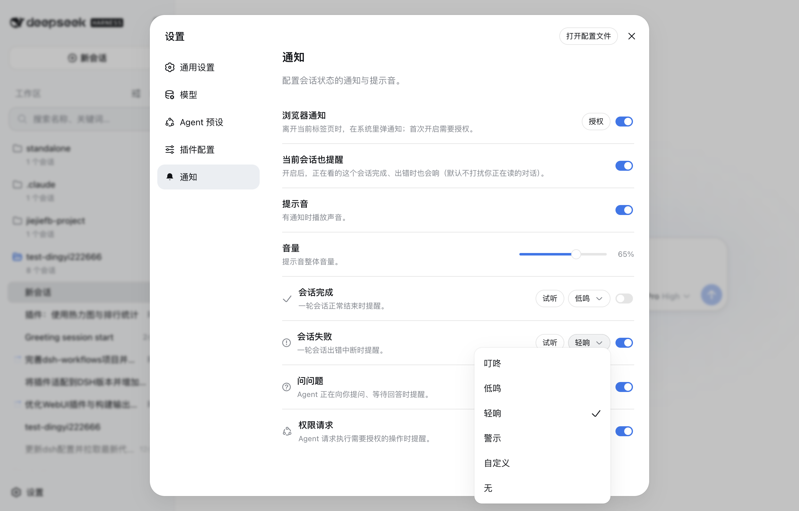

# dsh-session-notification

English | [中文](README.zh.md)

A notification plugin for the dsh web GUI. When a session finishes, hits an error, asks you a question, or needs your permission, you get a heads-up: a sound plays, and when you step away from the tab a system notification keeps you in the loop.

## Screenshots

The settings panel with the **通知 / Notifications** entry in the sidebar (bell icon) and the section content:


The sound picker for each kind (the official dropdown):



## The four notification kinds

| Kind | When it fires | Default sound |
| --- | --- | --- |
| 会话完成 / Session completed | A turn ends normally (`turn/end` completed) | 叮咚 chime |
| 会话失败 / Session failed | A turn breaks with an error, or the host reports an agent error | 低鸣 fault |
| 问问题 / Question asked | The agent is waiting for your answer (`question/requested`) | 轻响 pop |
| 权限请求 / Permission requested | The agent requests an authorized operation (`approval/requested`) | 警示 alert |

Each kind can be enabled or disabled and reassigned to any of the four built-in sound effects (or muted). The four sounds are synthesized with Web Audio — no audio files are shipped — and the master volume is adjustable with the official-style slider.

## Custom audio

Beyond the four built-in sounds, each kind accepts **your own audio file** (mp3/ogg/wav, up to 1 MB): pick 自定义音频 / Custom audio on a kind's row to upload one, and it replaces the built-in for that kind — with a 更换 / replace and remove affordance, plus the 已使用自定义音频 tag. Custom files are stored browser-locally (they are device media, not shared preferences).

## Browser notifications & the quiet default

Browser (system-level) notifications are **off by default**; turning the switch on asks for the browser's permission first (a user gesture). Once granted, a notification is shown when the event's session is not the one you are reading, or when the tab is in the background. The session you are reading stays **quiet by default** — its own events don't interrupt you; flip the 当前会话也提醒 / Alert for the current session toggle if you want it to alert too.

## The Notifications settings section

The plugin registers a **通知 / Notifications** section in the settings panel (设置 ⚙ → 通知):

- **浏览器通知** master switch (+ permission state and an enable button),
- **当前会话也提醒** toggle (opt in to being alerted while reading that session),
- **提示音** master switch,
- **音量** slider,
- one row per notification kind: enable switch, custom-audio upload, sound picker (the official dropdown menu), and a 试听 / preview button.

Preferences are stored in the Host user-settings document under the `dsh-session-notification` namespace — the same settings seam official plugins use — so they persist across sessions and sync across tabs.

## How it works

The browser half watches the sessions list snapshot and each session's conversation snapshot — no polling, no new wire channels:

- A session's `running` edge true→false ends a run; the run is classified **failed** when a new `turn-error` node or a host `agent-error` appeared during it, otherwise **completed** (a failure that a retry recovered reads as completed).
- A pending-interaction edge (`question` / `approval`) raises the question / permission kinds, with the question text or the tool name+reason in the notification body.
- Sessions already idle (or already pending) when the plugin loads raise nothing.

## Install

```sh
# 从 GitHub 安装（私有仓库，需已配置 GitHub 访问）
dsh plugin --profile web add github:dsh-external/dsh-session-notification
# 或本地安装
dsh plugin --profile web add /Users/dingyi/projects/dsh/dsh-session-notification
# 重启 dsh web 后生效
dsh web
```

One-time notes:

- The web client can only reach settings namespaces explicitly exposed by the host (`packages/host/apiproxy/src/api-proxy.ts`, `WEB_SETTINGS_NAMESPACES`); `dsh-session-notification` was added there. The plugin's node half registers the namespace through the settings service, exactly like `ui-theme` does.
- A notification bell (`IconBellOutline16`) was added to the official icon set and wired into the settings nav (`ui-settings-general`), so the 通知 section shows a bell instead of the default gear — this appears after the harness client bundle is rebuilt.
- The `notifyCurrent` preference is a schema field: it needs a `dsh web` restart to persist (it still works with its default until then).

## Development

- `pnpm run build` — builds the browser bundle (`lib/client.js`) and the Node half (`lib/index.js` / `lib/invariant.js`).
- `src/client/notification-service.ts` — the engine (classification) and dispatcher (gating); `src/client/settings-store.ts` — the settings section bridge; `src/client/NotificationsSection.tsx` — the section UI; `src/client/sounds.ts` + `src/client/custom-audio.ts` — the built-in and custom sounds.
- `pnpm exec vitest run tests/` — behavior tests; `pnpm exec tsc --noEmit` — type gate.
- Node-half changes need a `dsh web` restart; browser-bundle changes need a rebuild (`pnpm run build`) — a `--dev` server hot-reloads them.

## Known limitations

- Failure detection reads the conversation snapshot, which the client only maintains for sessions that have been opened; a session that runs without ever being opened notifies as completed even on failure.
- Browser notifications require permission, and sound playback requires the page to have user activation (the browser's autoplay policy) — both are normal for browser apps and resolve as soon as the user interacts with the GUI.
- Custom audio files live in the browser (localStorage), so they do not follow you across browsers or profiles.
- The browser half is event-driven from the sessions list; it does not observe the raw event stream, so a run that starts and finishes between two list snapshots could in principle be missed (the host sends a status flip per edge, so this does not happen in practice).

## Model Experience

None. The plugin is a pure client-side observer over the already-logged session state; nothing here reaches a model request.

#### KV Cache effect

None; this package neither assembles nor sends provider requests.
